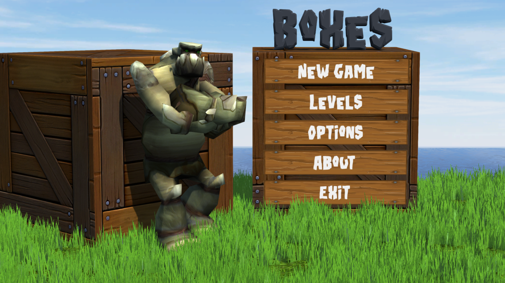
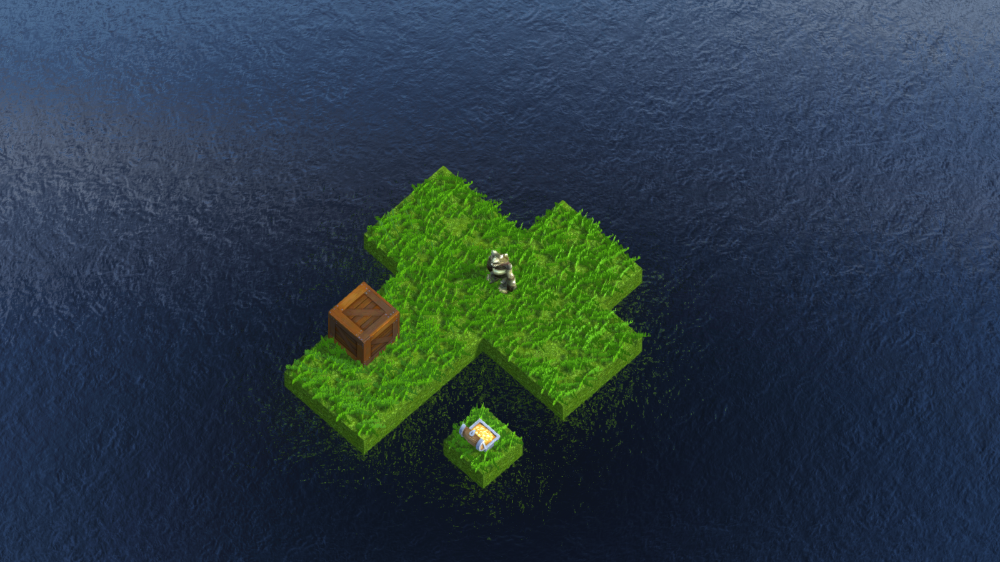
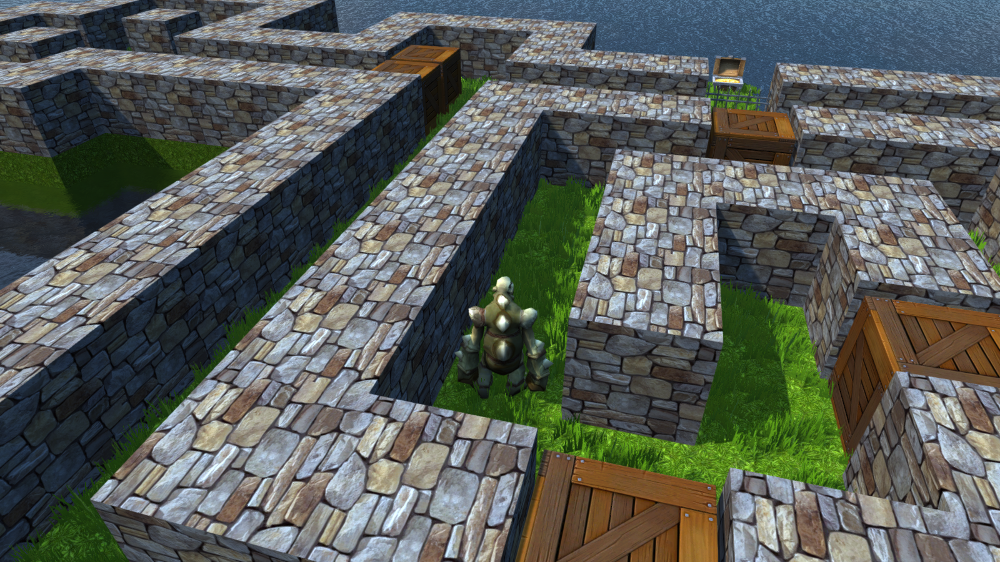
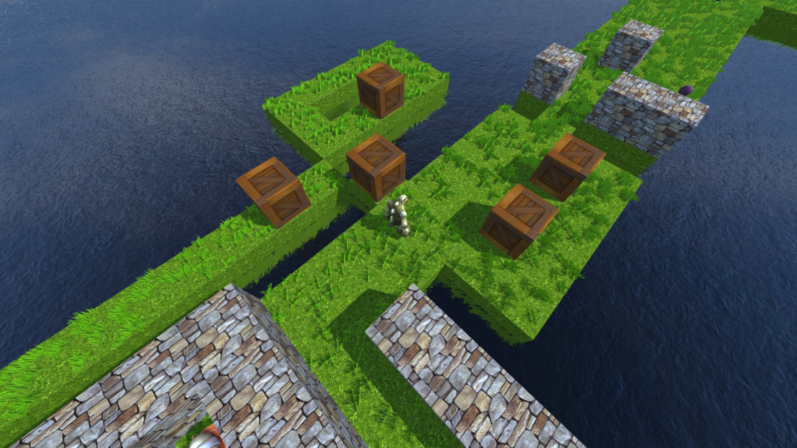
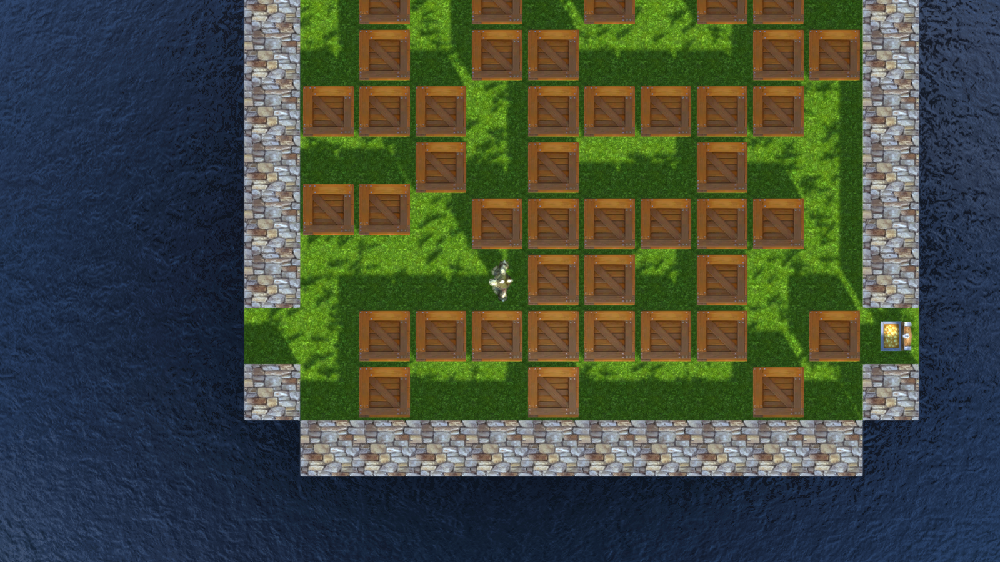
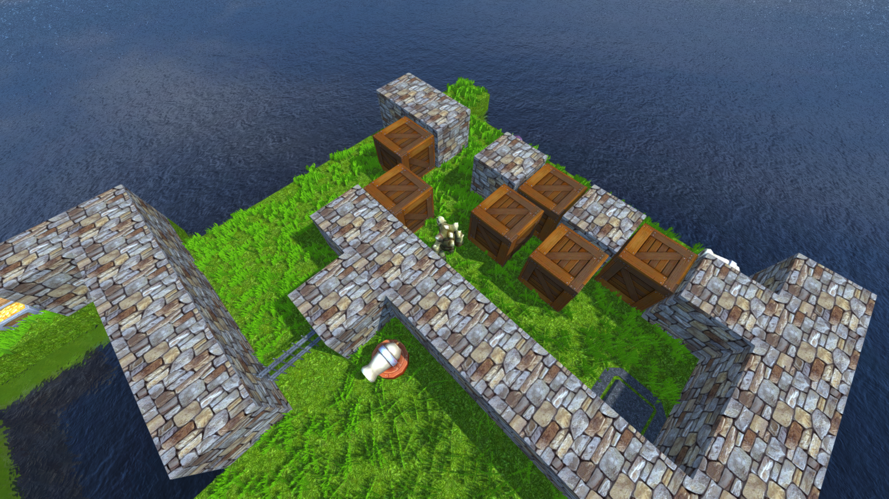
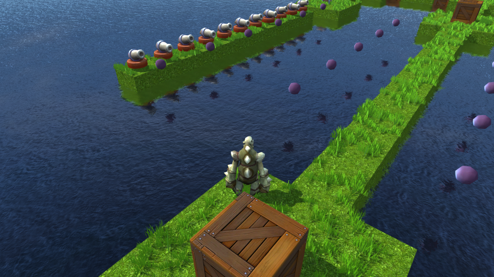
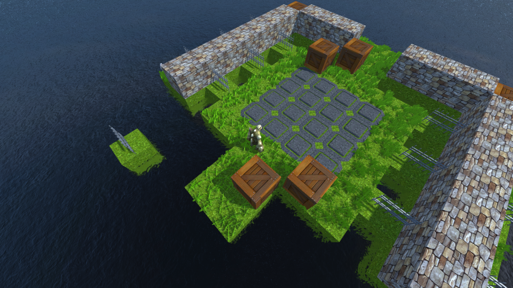

# Boxes-UnityGame
Boxes is a 3D logic game made in Unity. The game offers 10 levels with increasing level of difficulty. By changing camera (Key C) you can choose between third person view, isometric view and look from above. Game also provide a oportunity to play a specific level and changing options such music and sound effects volume.

## Getting started

### How can I get Boxes?
You can play this game by downloading it from Google Drive. Just [click here](https://drive.google.com/open?id=1HAo2EgMldjhUnpVM7s-_T8ATFYAG-8p0).

Of course, you can still download source code and start game from Unity desktop app :)

### Controls
- **W, S, A, D** - moving character
- **Shift** - run
- **C** - change camera
- **R** - restart level
- **Esc** - pause/menu

## Built with
[Unity](https://unity3d.com/)- a cross-platform game engine developed by Unity Technologies

## Screenshots

